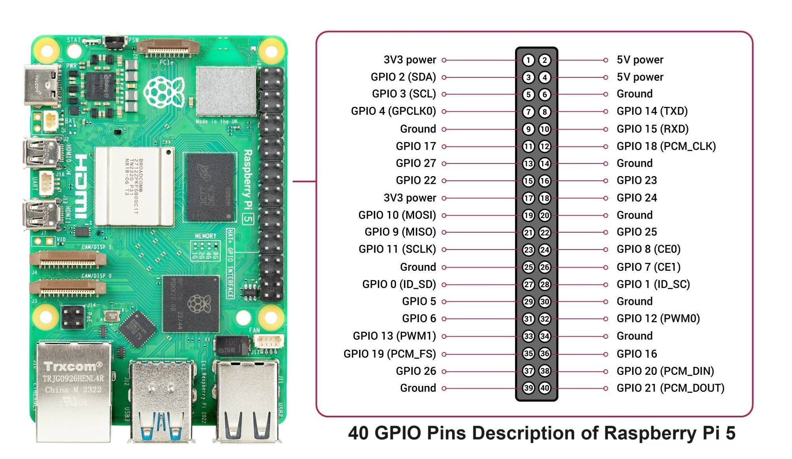

###  Theory

#### Introduction

The **Raspberry Pi** is a small, affordable single-board computer developed by the Raspberry Pi Foundation. It was originally created to promote the teaching of basic computer science in schools and developing countries, but has since gained popularity among hobbyists and professionals for a wide variety of projects.
   

The board can run a full Linux operating system (commonly Raspberry Pi OS) and is capable of performing tasks such as programming, running servers, automating hardware, and even creating media centers and IoT systems.

   

##### Power Pins

These pins supply power directly from the Pi to external components. Be careful while using them, as incorrect connections may damage the Pi.

| Pin Number | Voltage | Description       |
|------------|---------|-------------------|
| 1, 17      | 3.3V    | Constant 3.3V out |
| 2, 4       | 5V      | Constant 5V out   |
| 6, 9, 14, 20, 25, 30, 34, 39 | GND | Ground connection |

#####  GPIO Pins

These pins can be configured as either **inputs** or **outputs**, and are controlled using programming languages like Python.

- **Input mode**: Used to read signals from sensors like switches, temperature sensors, etc.
- **Output mode**: Used to control devices like LEDs, buzzers, or relays.

 The physical pin number (1 to 40) is different from the GPIO numbering (GPIO0 to GPIO27 and beyond).

| GPIO Number | Physical Pin | Default Function     |
|-------------|---------------|----------------------|
| GPIO2       | Pin 3         | SDA1 (I2C)           |
| GPIO3       | Pin 5         | SCL1 (I2C)           |
| GPIO4       | Pin 7         | General GPIO         |
| GPIO17      | Pin 11        | General GPIO         |
| GPIO27      | Pin 13        | General GPIO         |
| GPIO22      | Pin 15        | General GPIO         |
| GPIO10      | Pin 19        | MOSI (SPI)           |
| GPIO9       | Pin 21        | MISO (SPI)           |
| GPIO11      | Pin 23        | SCLK (SPI)           |
| GPIO14      | Pin 8         | TXD (UART Transmit)  |
| GPIO15      | Pin 10        | RXD (UART Receive)   |

##### Special Function Pins

Some GPIOs are **multiplexed** with special functions like I2C, SPI, and UART. These protocols are useful for communicating with microcontrollers, displays, or sensors.

#####  I2C (Inter-Integrated Circuit)
- A communication protocol using 2 wires: data (SDA) and clock (SCL).
- Used for sensors, EEPROMs, RTC modules.

| Pin | GPIO | Function |
|-----|------|----------|
| 3   | GPIO2 | SDA1     |
| 5   | GPIO3 | SCL1     |

##### SPI (Serial Peripheral Interface)
- High-speed full-duplex protocol for sensors, ADCs, or displays.

| Pin | GPIO | Function |
|-----|------|----------|
| 19  | GPIO10 | MOSI (Master Out Slave In) |
| 21  | GPIO9  | MISO (Master In Slave Out) |
| 23  | GPIO11 | SCLK (Serial Clock)        |
| 24  | GPIO8  | CE0 (Chip Enable 0)        |
| 26  | GPIO7  | CE1 (Chip Enable 1)        |

##### UART (Universal Asynchronous Receiver/Transmitter)
- Serial communication used to connect with GPS modules, serial consoles, or other microcontrollers.

| Pin | GPIO | Function |
|-----|------|----------|
| 8   | GPIO14 | TXD (Transmit) |
| 10  | GPIO15 | RXD (Receive)  |

#### Uses of Raspberry Pi

The Raspberry Pi is extremely versatile. Common applications include:

1. **Learning and Education**
- Programming practice (Python, C++, Java)
- Linux terminal and scripting

 2. **IoT Projects**
- Home automation
- Sensor-based systems
- Smart lighting, weather stations

 3. **Web Servers**
- Hosting lightweight websites using Apache, Nginx, or Flask

 4. **Robotics**
- Controlling motors, servos, and other actuators
- Real-time data from sensors (ultrasonic, IR, etc.)

6. **Networking**
- Pi-hole for ad blocking
- VPN server setup

